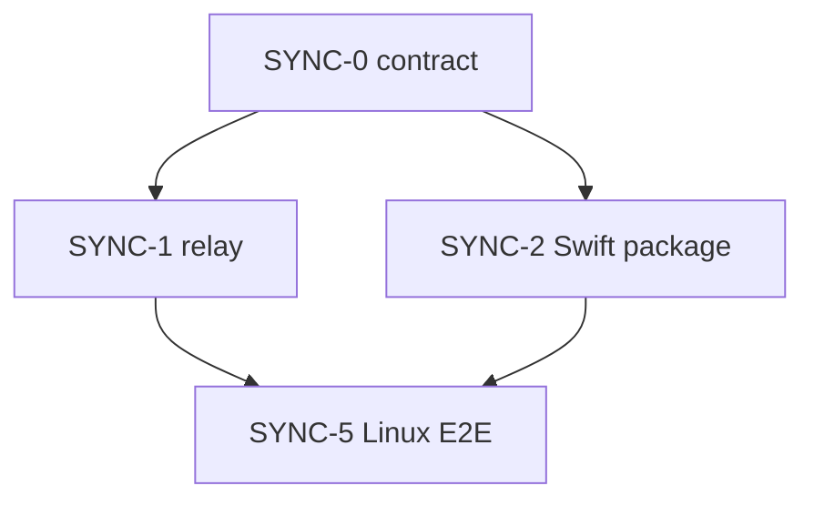

# 15 — 同期実装の作業切り分け（エージェント振り分け）

最終更新: 2026-09-12。契約は [13](13-sync-mac-companion.md)。Mac 画面は [14](14-mac-companion-ux.md)。  
チケット本文は [issues/](issues/)。

**Linux 隊列（SYNC-0 → 1∥2 → 5）は `develop` 済み。** 残る画面（カメラ / Face ID / メニューバー）だけが実機待ち。

この環境から GitHub Issue は作れない。貼り付けは [issues/README.md](issues/README.md)。

## リポジトリ構成（確定）

**このリポジトリをポリグロットのまま使う。別リポにも JS モノレポにもしない。**

型安全の芯は iOS と Mac が同じ Swift パッケージをリンクすること。Linux では `swift test`（[swift-crypto](https://github.com/apple/swift-crypto)、CryptoKit にしない）。リレーとの契約は `sync/contract` の黄金 JSON。

```
Todo-Train/
  Packages/TodoTrainSync/     Swift。UI なし。Linux で swift test
  sync/contract/              契約の正本
  sync/worker/                Hono + Durable Object
  sync/e2e/                   Linux 結合（client ↔ worker）
  Todo train/                 iOS（UI は SYNC-3、後回し）
```

CloudKit ゲートは触らない。

## Linux 隊列（完了）



| ID | 役割 | パス | 状態 |
|----|------|------|------|
| [SYNC-0](issues/SYNC-0-contract.md) | 契約をファイルにする | `sync/contract/**` | **完了** |
| [SYNC-1](issues/SYNC-1-relay.md) | Hono + DO | `sync/worker/**` | **完了**。CI: `sync-worker` |
| [SYNC-2](issues/SYNC-2-swift-package.md) | 暗号・状態機械・停車判定・残り計算 | `Packages/TodoTrainSync/**` | **完了**。CI: `sync-swift` |
| [SYNC-5](issues/SYNC-5-linux-e2e.md) | パッケージがローカル Worker と暗号化往復する | `sync/e2e/**` | **完了**。CI: `sync-swift` |

品質ゲート:

- Worker: `cd sync/worker && npm test`
- パッケージ: `cd Packages/TodoTrainSync && ../../sync/linux-swift.sh test`
- 結合: `./sync/e2e/run.sh`

Cloudflare ホストは本番 `https://todo-train.hibiki-cube.dev`、develop `https://dev.todo-train.hibiki-cube.dev`。secrets（`CLOUDFLARE_API_TOKEN` / `CLOUDFLARE_ACCOUNT_ID`）が無いときは workflow が deploy を skip する。ゾーン `hibiki-cube.dev` は同じ Cloudflare アカウントに置く。

## 実機が空いてから

| ID | 役割 | 環境 |
|----|------|------|
| [SYNC-3](issues/SYNC-3-ios.md) | Settings のセルフィー UI と SessionManager 配線 | Mac + Xcode |
| [SYNC-4](issues/SYNC-4-macos.md) | メニューバーとウェブカメラ枠 | Mac + Xcode |

Linux Cloud Agent には投げない。蓋を開けた Mac で `cursor worker start` が生きていればセルフホストへ振れる。

## エージェントへの拘束

- 自分のチケットのパス以外を書き換えない
- 13 と矛盾するプロトコルを発明しない
- アカウント、CloudKit on、APNs、ポーリング、LAN 主経路、CRDT、`pause` 以外の cmd を足さない
- 1 PR = 1 チケット

## 人間がやること

1. SYNC-3 / 4 は Mac が空いたときに振る（Issue は作らなくてもよい）
2. Cloudflare を載せるならリポジトリ secrets を足す。ゾーン `hibiki-cube.dev` も同じアカウントへ。手順は `sync/worker/README.md`
3. セルフィーとメニューバーは、手が空いたときの実機確認
