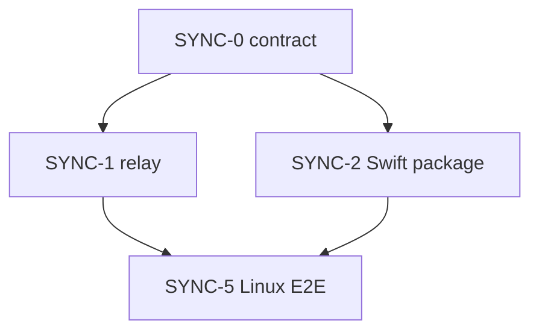

# 15 — 同期実装の作業切り分け（エージェント振り分け）

最終更新: 2026-09-08。契約は [13](13-sync-mac-companion.md)。Mac 画面は [14](14-mac-companion-ux.md)。  
チケット本文は [issues/](issues/)。

**人手と Mac 起動は、今の隊列では不要。** Linux Cloud Agent だけで SYNC-0 → 1∥2 → 5 まで完走できる。カメラ / Face ID / メニューバーの見た目だけが実機待ち。

この環境から GitHub Issue は作れない。貼り付けは [issues/README.md](issues/README.md)。

## リポジトリ構成（確定）

**このリポジトリをポリグロットのまま使う。別リポにも JS モノレポにもしない。**

型安全の芯は iOS と Mac が同じ Swift パッケージをリンクすること。Linux では `swift test`（[swift-crypto](https://github.com/apple/swift-crypto)、CryptoKit にしない）。リレーとの契約は `sync/contract` の黄金 JSON。

```
Todo-Train/
  Packages/TodoTrainSync/     Swift。UI なし。Linux で swift test
  sync/contract/              契約の正本
  sync/worker/                Hono + Durable Object
  sync/e2e/                   Linux 結合（client ↔ worker）
  Todo train/                 iOS（UI は SYNC-3、後回し）
```

CloudKit ゲートは触らない。

## 今振れる隊列（全部 Linux）



| ID | 役割 | 触ってよいパス | 環境 |
|----|------|----------------|------|
| [SYNC-0](issues/SYNC-0-contract.md) | 契約をファイルにする | `sync/contract/**`、13 の追記のみ | Linux |
| [SYNC-1](issues/SYNC-1-relay.md) | Hono + DO | `sync/worker/**` | Linux。Node + wrangler |
| [SYNC-2](issues/SYNC-2-swift-package.md) | 暗号・状態機械・停車判定・残り計算 | `Packages/TodoTrainSync/**` | Linux。`swift test`。**xcodeproj 禁止** |
| [SYNC-5](issues/SYNC-5-linux-e2e.md) | パッケージがローカル Worker と暗号化往復する | `sync/e2e/**` | Linux。1 と 2 のあと |

完了の定義は **Linux 上のテストが赤でない** こと。シミュレータを待たない。

SYNC-2 に含める（画面は書かない）:

- エンベロープ、URL、client、ペアリング状態機械（光学揃い → bind → LA）。LA / カメラは protocol
- リモート停車の純関数（sessionId 不一致 / 停車上限 / 適用可）。`SessionManager` は呼ばない
- メニューバー用の表示状態（snap + now → タイトル・残り・停車可否・送信中）。Date ベース

これで「iPhone が停車を受け付けるか」「Mac に何が出るか」は Linux で決まる。

## 実機が空いてから（今は振らない）

| ID | 役割 | 環境 |
|----|------|------|
| [SYNC-3](issues/SYNC-3-ios.md) | Settings のセルフィー UI と SessionManager 配線 | Mac + Xcode |
| [SYNC-4](issues/SYNC-4-macos.md) | メニューバーとウェブカメラ枠 | Mac + Xcode |

Issue は先に作っておいてよい。着手しない。蓋を開けた Mac で `cursor worker start` が生きていれば、そのときセルフホストへ振れる（今は worker ゼロ）。

## エージェントへの拘束

- 自分のチケットのパス以外を書き換えない
- 13 と矛盾するプロトコルを発明しない
- アカウント、CloudKit on、APNs、ポーリング、LAN 主経路、CRDT、`pause` 以外の cmd を足さない
- 1 PR = 1 チケット

## 人間がやること（手が空いていないとき）

1. この PR をマージする（Web で足りる）
2. Issue を 0, 1, 2, 5 だけ作る（3/4 は作らなくてもよい）
3. Cloud Agent に SYNC-0 を渡す。以降 Mac を開かなくてよい
4. セルフィーとメニューバーは、手が空いたときの実機確認
