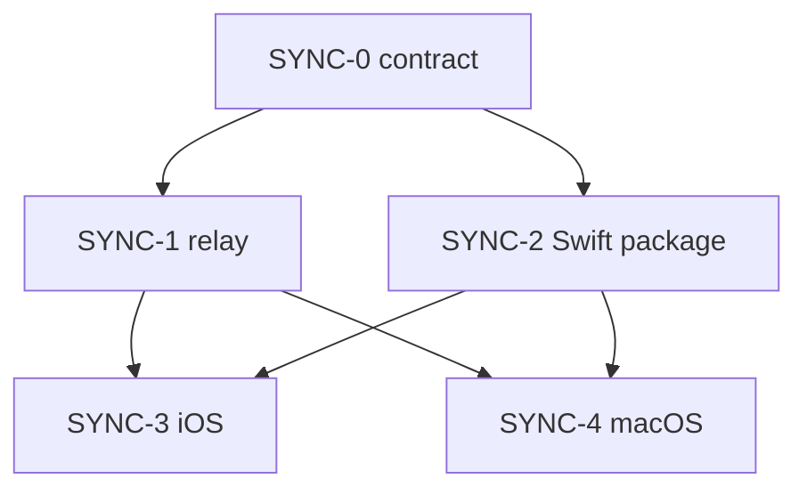

# 15 — 同期実装の作業切り分け（エージェント振り分け）

最終更新: 2026-09-06。契約は [13](13-sync-mac-companion.md)。Mac 画面は [14](14-mac-companion-ux.md)。  
チケット本文は [issues/](issues/)（GitHub Issue に貼る用）。

この環境から GitHub Issue は作れない（`gh` は読取のみ）。貼り付け手順は [issues/README.md](issues/README.md)。

## リポジトリ構成（確定）

**このリポジトリをポリグロットのまま使う。別リポジトリにも、npm/Turborepo のモノレポにもしない。**

| 案 | 判断 |
|----|------|
| リレーを別リポ | 捨てる。Worker は小さい。Issue・契約・docs が割れる。エージェントが 13/14 を見失う |
| JS モノレポ（workspaces / turbo） | 捨てる。Swift の型安全は TS の monorepo では得られない。道具だけ増える |
| ポリグロット 1 リポ | **採用。** iOS と Mac の型は Swift パッケージで共有。リレーとの契約は JSON / フィクスチャ |

型安全の芯は「iOS と Mac が同じ Swift をリンクする」こと。Hono 側は同じフィクスチャをテストする。Quicktype で Swift を生成しなくてよい（手書き Codable + 黄金 JSON）。

目標レイアウト（未作成。各チケットが自分のディレクトリを作る）:

```
Todo-Train/
  Todo train/                 iOS アプリ（既存）
  TodoTrainWidget/            既存
  Packages/TodoTrainSync/     Swift: 暗号・エンベロープ・HTTP/WS。UI なし
  sync/
    contract/                 契約の正本（JSON Schema + 黄金 JSON）。コードなし
    worker/                   Hono + Durable Object。Xcode を触らない
  docs/
```

CloudKit ゲートは触らない。Apple Developer Program はこのフェーズで不要。

## 依存（並列の切り方）



SYNC-1 と SYNC-2 は **同時に別エージェント**。SYNC-3 と SYNC-4 も、2 が終われば同時。  
1 人のエージェントに Worker と Xcode を混ぜない。

| ID | 役割 | 触ってよいパス | 環境 | 依存 |
|----|------|----------------|------|------|
| [SYNC-0](issues/SYNC-0-contract.md) | 契約をファイルにする | `sync/contract/**`、docs の契約追記のみ | どれでも | なし |
| [SYNC-1](issues/SYNC-1-relay.md) | Hono + DO | `sync/worker/**`（contract は読むだけ） | Node + wrangler。Xcode 不要 | SYNC-0 |
| [SYNC-2](issues/SYNC-2-swift-package.md) | Swift 同期ライブラリ | `Packages/TodoTrainSync/**` | Swift / Xcode。UI 禁止 | SYNC-0 |
| [SYNC-3](issues/SYNC-3-ios.md) | iOS ペアリングと停車適用 | iOS ターゲットと Settings。Mac ターゲット禁止 | **Mac + Xcode** | SYNC-0, 2。結合は 1 |
| [SYNC-4](issues/SYNC-4-macos.md) | メニューバー | macOS ターゲット。iOS Hub/Focus 禁止 | **Mac + Xcode** | SYNC-0, 2。結合は 1。画面は 14 の提案値 |

## Mac 体験の未確認

[14](14-mac-companion-ux.md) の 1–6 は未回答でも **提案値を実装デフォルト**にする。SYNC-0〜2 は待たない。覆すなら SYNC-4 の前に 14 を直す。

## エージェントへの拘束

- 自分のチケットの「触ってよいパス」以外を書き換えない
- [13](13-sync-mac-companion.md) と矛盾するプロトコルを発明しない
- アカウント、CloudKit on、APNs、ポーリング、LAN 主経路、CRDT、`pause` 以外の cmd を足さない
- 1 PR = 1 チケット。ブランチ名は `cursor/sync-0-contract-…` のように ID を入れる

## 人間がやること

1. この PR を `develop` に入れる
2. [issues/README.md](issues/README.md) の順で GitHub Issue を作る
3. SYNC-0 を 1 エージェントへ
4. 0 がマージされたら 1 と 2 を並列
5. 3 と 4 は Mac が要る。Cloud Agent だけに投げない
